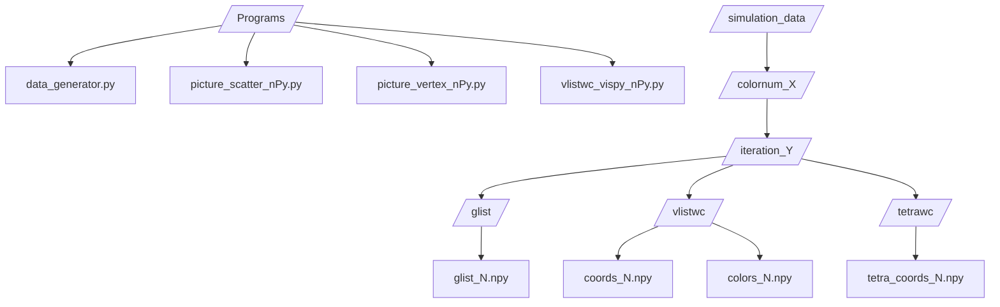

# Introduction
## The structure of the repository
### Directories of program codes and data storing


## How to use
### 1. Activate the virtual environment of Python 3.10.12
<table>
 <thead>
  <tr>
   <th>OS</th> <th>command line</th>
  </tr>
 </thead>
 <tr>
  <td> Linux/mac </td> <td> <code>source run_venv/bin/activate</code> </td>
 </tr>
 <tr>
  <td >Windows </td> <td>  <code>/run_venv/bin/activate</code> </td>
 </tr>
</table>
to be able to use modules for runniing codes in the 'Programs' directory.

### 2. Run *data_generator.py*
```
python3 data_generator.py
```
to obtain data that are automatically stored in 'Simulation_Data' directory (Sample data have been already prepared in 'Simulation_Data' though :smile:).
### 3. Visualize data
- **glist**:
 - `picture_scatter_nPy.py`
 - `picture_vertex_nPy.py`
- **vlistwc**:
 - `vlistwc_vispy_nPy.py`
